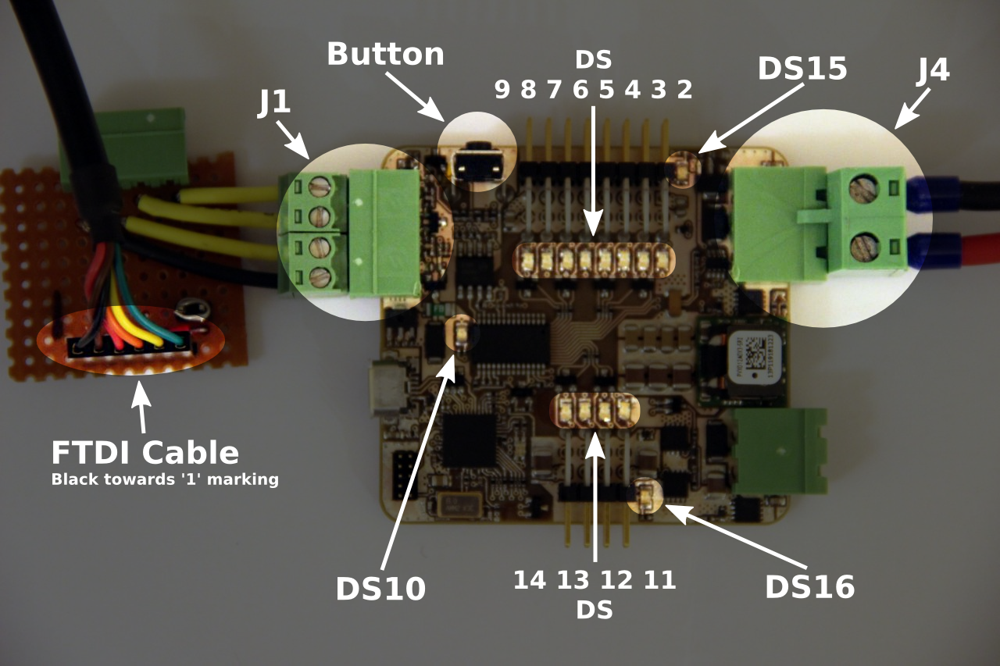

Student Robotics SBv4b Manufacture Test Procedure[^1]
===============================================

Test Jig Parts
==============

 * Netbook (white)
 * Netbook power supply
 * FTDI cable (black)
 * Power cable (red/black with green plug and fork terminals)
 * UART adaptor

Test Jig Setup
==============

1. Connect red/black power cable to bench power supply
1. Set bench power supply to 12V with 100mA current limit
1. Plug netbook power supply into netbook/mains socket
1. Plug FTDI cable into netbook
1. Plug FTDI cable into UART adaptor
1. Turn netbook on. Type 'sbv4b' and press enter

Board Test Procedure
====================

Figure 1 shows a board with the power and FTDI cables connected and the location of the various LEDs.

1. Plug red/black power cable into J4
2. Plug UART adaptor into J1
3. Green LED DS1 must illuminate
4. Turn on bench power supply
5. The board must not draw more than 40mA
6. Press the push button on the side of the board
7. Press enter on the netbook
8. The netbook must report that it has succesfully flashed the board
9. The board should perform the following actions in sequence. It will repeat the sequence forever. If a particular action does not happen, or it stops, then the potential problem components are listed

   | Indication       | Potential causes of failure    |
   |------------------|--------------------------------|
   | DS9 flash blue   | DS9, RN2, U2, Y1               |
   | DS8 flash blue   | DS8, RN2, U2, Y1               |
   | DS7 flash blue   | DS7, RN2, U2, Y1               |
   | DS6 flash blue   | DS6, RN2, U2, Y1               |
   | DS5 flash blue   | DS5, RN1, U2, Y1               |
   | DS4 flash blue   | DS4, RN1, U2, Y1               |
   | DS3 flash blue   | DS3, RN1, U2, Y1               |
   | DS2 flash blue   | DS2, RN1, U2, Y1               |
   | DS11 flash blue  | DS11, RN3, U2, Y1              |
   | DS12 flash blue  | DS12, RN3, U2, Y1              |
   | DS13 flash blue  | DS13, RN3, U2, Y1              |
   | DS14 flash blue  | DS14, RN3, U2, Y1              |
   | DS15 turn on green | DS15, R29, R18, U5, U7, U8, R26, R9, R10 |
   | DS16 turn on green | DS16, R30, Q4, Q5, Q6, R33   |
   | DS15 and DS16 turn off |                          |
   | DS10 flash blue  | DS10, R4, U2, Y1               |
   | DS10 flash red   | DS10, R5, U2, Y1               |

10. Turn off bench power supply and remove power cable and UART adaptor, ready for the next board

